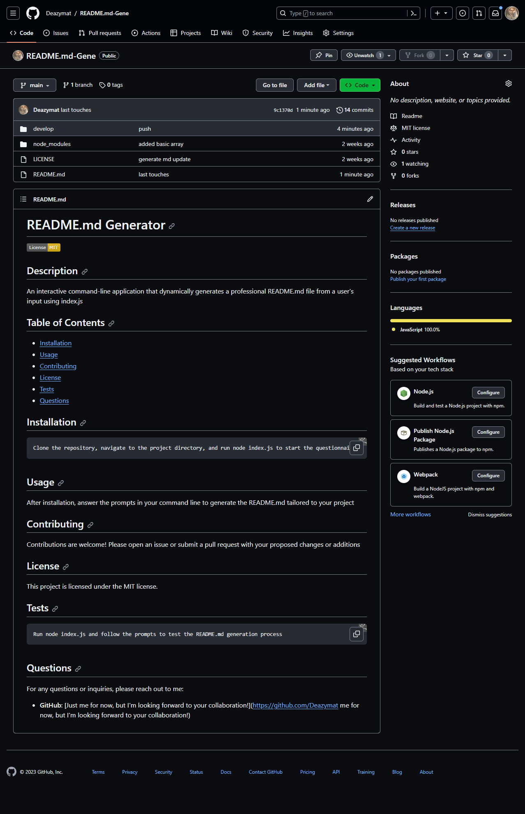

# README.md Generator


## Description

An interactive command-line application that dynamically generates a professional README.md file from a user's input using index.js

## Table of Contents

- [Installation](#installation)
- [Usage](#usage)
- [Contributing](#contributing)
- [License](#license)
- [Tests](#tests)
- [Questions](#questions)
- [Screenshot](#screenshot)

## Installation

```
Clone the repository, navigate to the project directory, and run node index.js to start the questionnaire.
```
## video

https://drive.google.com/file/d/1Z0APBg-agARnIW8mfhVCFZ1vjfsqmuIp/view

## Screenshot



## Usage

After installation, answer the prompts in your command line to generate the README.md tailored to your project

## Contributing

Thanks to https://chat.openai.com/ , and Github copilot as resources

## License

This project is licensed under the MIT license.

## Tests

```
Run node index.js and follow the prompts to test the README.md generation process
```

## Questions

For any questions or inquiries, please reach out to me:

- **GitHub**: [Just me for now, but I'm looking forward to your collaboration!](<https://github.com/Deazymat> me for now, but I'm looking forward to your collaboration!)

